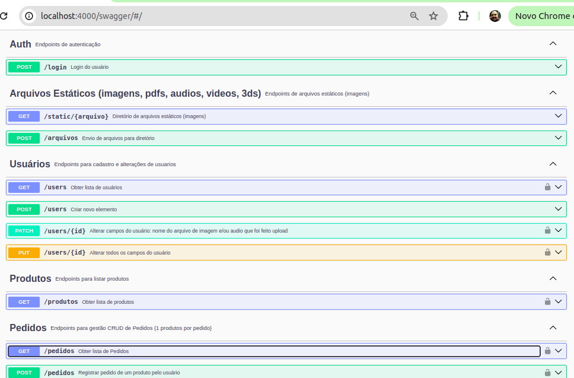

<h1 align="center">CASE4YOU</h1>

<p align="center">🚀 Projeto que utiliza o json-server para mockar uma REST API e Swagger para documentar, também cria um diretório para upload de imagem e utiliza autenticação JWT</p><br>

## Tecnologias

- [VSCode](https://code.visualstudio.com/)
- [Node](https://nodejs.org/en)
- [Git](https://git-scm.com)
- [json-server Authentication ](https://www.npmjs.com/package/json-server-auth)
- [Swagger](https://swagger.io/)
- [JWT](https://jwt.io/)

### Descrição
Este projeto utiliza como base o json-server, simulando uma fake API para ser utilizada como base para projetos de estudo WEB e Mobile

### Pré-requisitos e Como utilizar
Antes de começar, você vai precisar ter instalado em sua máquina as seguintes ferramentas:
[Git](https://git-scm.com), [Node.js](https://nodejs.org/en/). 
Além disto é bom ter um editor para trabalhar com o código como [VSCode](https://code.visualstudio.com/)

### 👨🏽‍💻 Rodando o Back End (servidor)
#### Clone este repositório, abra com VsCode e em um terminal **bash** ou **cmd**

```bash
# Instale as dependências
$ npm install

# Execute a aplicação 
$ npm start
# O servidor inciará na porta:4000 - acesse <http://localhost:4000/swagger> para ver a documentação
```
- A API possui autenticação JWT, para acessar os endpoints protegidos é necessário passar o token no header da requisição
- Basta criar um usuário na rota /users e fazer login na rota /login para obter o token
- Exemplo de dados para a criação de um usuário:
```json
    {
      "email": "silvia@email.com",
      "password": "senai123",
      "nome": "Silvia Santos Oliveira",
      "cpf": "361.347.054-14",
      "nascimento": "2000-03-05",
      "telefone": "(11)22222-2222",
    }
```
- Mais instruções sobre a utilização através do SWAGGER

## Instruções para implantação em Rede Local
- 1 alterar "localhost" para o IP local e porta no caminho da linha 10 no arquivo swagger.json
```json
    "url": "http://localhost:4000",
```

- 2 Para dispensar a autenticação JWT comente as linhas a seguir do arquivo server.js
```js
const rules = auth.rewriter({
    "/users*": "/660/users$1",
    "/produtos*": "/660/produtos$1",
    "/pedidos*": "/660/pedidos$1",
    "/colaboradores*": "/660/colaboradores$1",
    "/avaliacoes*": "/660/avaliacoes$1"
});
```
```js
const rules = auth.rewriter({
    // "/users*": "/660/users$1",
    // "/produtos*": "/660/produtos$1",
    // "/pedidos*": "/660/pedidos$1",
    // "/colaboradores*": "/660/colaboradores$1",
    // "/avaliacoes*": "/660/avaliacoes$1"
});
```
- 3 Executar com os comandos
```bash
npm install
npx nodemon
```

